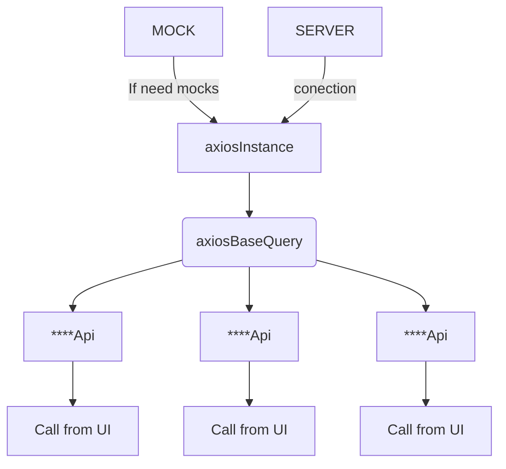

# Links on Documentation RTK 
[RTK Query Overview](https://redux-toolkit.js.org/rtk-query/overview)

[Queries(GET)](https://redux-toolkit.js.org/rtk-query/usage/queries)

[Mutations(POST/PUT/PATCH/PUT/DELETE)](https://redux-toolkit.js.org/rtk-query/usage/mutations)

[How to cache control in RTK](https://redux-toolkit.js.org/rtk-query/usage/cache-behavior)

[Error Handling](https://redux-toolkit.js.org/rtk-query/usage/error-handling)

[If neeed use custom BaseQuery for send req to server ](https://redux-toolkit.js.org/rtk-query/usage/customizing-queries#axios-basequery)

# How it works with us 

## AxiosInstance
https://github.com/Vladyslav-Team/frontend/blob/main/src/shared/api/services/axiosInstances.js#L4-L9
How realized axiosInstance

## AxiosBaseQuery
https://github.com/Vladyslav-Team/frontend/blob/main/src/shared/api/services/axiosInstances.js#L11-L26
How realized axiosBaseQuery

## How to create instance api Queries and Mutations on exemple AuntificationApi

### **Mutations**
https://github.com/Vladyslav-Team/frontend/blob/main/src/shared/api/services/authentication.js#L9-L22

[`data` is a body in reqwest  ](https://github.com/Vladyslav-Team/frontend/blob/main/src/shared/api/services/authentication.js#L13)		

### **Queries**
https://github.com/Vladyslav-Team/frontend/blob/main/src/shared/api/services/authentication.js#L23-L28
	
		

## How to use connect create instance api with store 
https://github.com/Vladyslav-Team/frontend/blob/main/src/store/index.js

[Add the generated reducer as a specific top-level slice](https://github.com/Vladyslav-Team/frontend/blob/main/src/store/index.js#L18)
[Adding the api middleware enables caching, invalidation, polling,  
 and other useful features of `rtk-query`.](https://github.com/Vladyslav-Team/frontend/blob/main/src/store/index.js#L28)

## Use Hooks in Components

### **Mutations**

[Triggering `updatePostOne` will affect the result in this component,  
but not the result in `ComponentTwo`, and vice-versa](https://github.com/Vladyslav-Team/frontend/blob/main/src/components/SigninPopup/SigninPopup.jsx#L13)

https://github.com/Vladyslav-Team/frontend/blob/main/src/components/SigninPopup/SigninPopup.jsx#L28

### **Queries**

[Using a query hook automatically fetches data and returns query values](https://github.com/Vladyslav-Team/frontend/blob/main/src/components/pages/Profile/Profile.jsx#L12)

[Cache control](https://github.com/Vladyslav-Team/frontend/blob/main/src/components/pages/Profile/Profile.jsx#L13)

### Frequently Used Query Hook Return Values[​](https://redux-toolkit.js.org/rtk-query/usage/queries#frequently-used-query-hook-return-values "Direct link to heading")

The query hook returns an object containing properties such as the latest  `data`  for the query request, as well as status booleans for the current request lifecycle state. Below are some of the most frequently used properties. Refer to  [`useQuery`](https://redux-toolkit.js.org/rtk-query/api/created-api/hooks#usequery)  for an extensive list of all returned properties.

-   `data`  - The latest returned result regardless of hook arg, if present.
-   `currentData`  - The latest returned result for the current hook arg, if present.
-   `error`  - The error result if present.
-   `isUninitialized`  - When true, indicates that the query has not started yet.
-   `isLoading`  - When true, indicates that the query is currently loading for the first time, and has no data yet. This will be  `true`  for the first request fired off, but  _not_  for subsequent requests.
-   `isFetching`  - When true, indicates that the query is currently fetching, but might have data from an earlier request. This will be  `true`  for both the first request fired off, as well as subsequent requests.
-   `isSuccess`  - When true, indicates that the query has data from a successful request.
-   `isError`  - When true, indicates that the query is in an  `error`  state.
-   `refetch`  - A function to force refetch the query

In most cases, you will probably read  `data`  and either  `isLoading`  or  `isFetching`  in order to render your UI.
